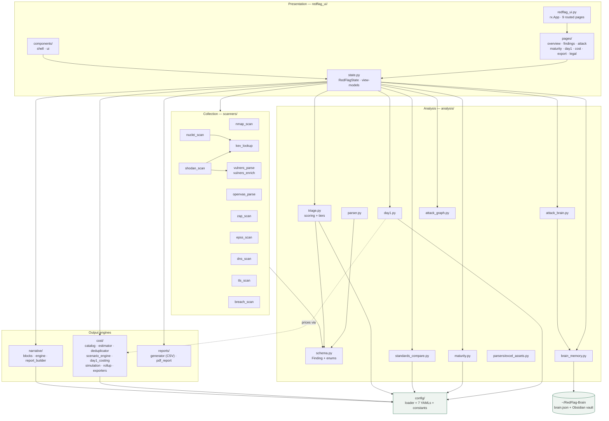
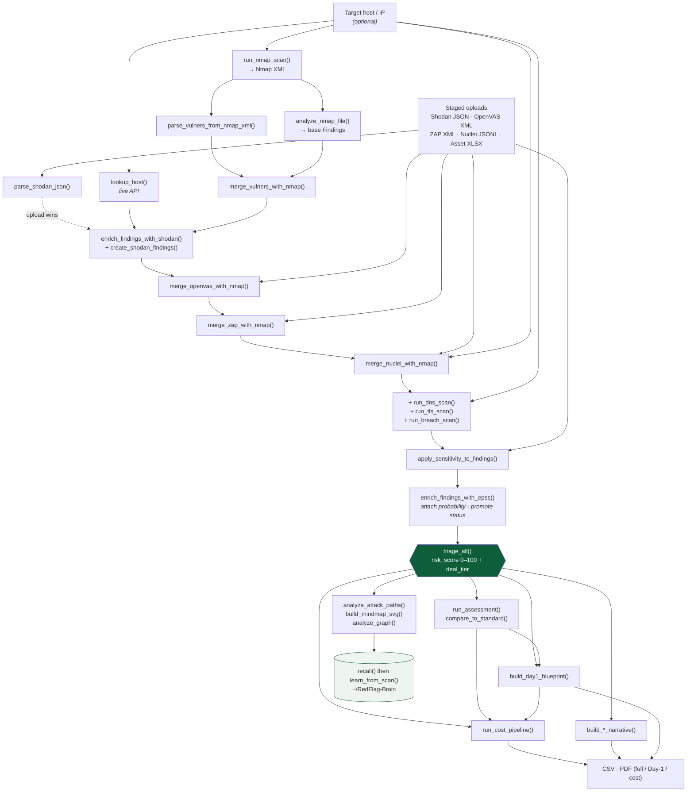

# Architecture

How RedFlag is structured, how data flows through it, and where to plug new things in.

_Last updated: 2026-07-27 · Owner: Adi · Status: Handover_

---

## 1. High-level overview

RedFlag is a single-process Python application with a Reflex (Next.js/React) front end. One user
action — **Run scan** — drives a thirteen-step pipeline that collects evidence from up to twelve
sources, correlates it into a single `Finding` set, scores it, and then fans that one set out to
five independent analysis engines (maturity, Day-1 planning, cost, attack-path reasoning,
narrative) before serialising the result to CSV, PDF and a persistent knowledge base.

The organising principle is **one unified risk picture**: no scanner renders its own output. Each
source either creates `Finding` objects or improves existing ones.

---

## 2. Layered architecture

Four layers, with a strict dependency direction — each layer may import from the layers below it,
never above.

```
┌──────────────────────────────────────────────────────────────┐
│  PRESENTATION            redflag_ui/                          │
│  Reflex components, routed pages, RedFlagState                │
│  Contains NO business logic — calls engines, flattens output  │
│  into flat view-model dataclasses                             │
└──────────────────────────────────────────────────────────────┘
           │ calls
┌──────────────────────────────────────────────────────────────┐
│  ENGINES     analysis/   cost/   narrative/   reports/         │
│  Pure, deterministic, offline. Same input → same output.       │
└──────────────────────────────────────────────────────────────┘
           │ consumes
┌──────────────────────────────────────────────────────────────┐
│  COLLECTION              scanners/                            │
│  The ONLY layer that performs network I/O.                    │
│  Every function degrades to [] rather than raising.           │
└──────────────────────────────────────────────────────────────┘
           │ configured by
┌──────────────────────────────────────────────────────────────┐
│  CONFIGURATION           config/                              │
│  Constants module + 7 YAML files + a cached loader            │
└──────────────────────────────────────────────────────────────┘
```

**State management.** All UI state lives in one class, `RedFlagState` in
[`redflag_ui/state.py`](../../redflag_ui/state.py). Raw engine objects (`_findings`,
`_assessment`, `_gap_report`, `_staged`, `_rollup`) are held in **backend-only vars** — the
leading underscore stops Reflex from serialising them to the browser — so they can be re-fed to
the Day-1, cost and export engines on demand without a rescan.

**Why the separation is load-bearing.** The UI was migrated from Streamlit to Reflex in June 2026
with zero changes to any engine. That migration is the practical proof the boundary holds.

---

## 3. Component diagram



---

## 4. Data-flow diagram



**Ordering constraints that matter**

- Vulners NSE data is parsed from the *same* Nmap XML, so it must run after the scan and before
  the merges.
- A **staged Shodan JSON takes priority over the live API call** — an upload skips the credit
  spend entirely.
- Correlation merges (OpenVAS → ZAP → Nuclei) all run against the Nmap layer and are order
  independent between themselves, but must precede triage.
- EPSS runs **last before triage**, because promoting `exploit_status` changes the score.
- `recall()` is always called **before** `learn_from_scan()`, so the insights shown reflect what
  the brain knew coming in, not what it just learned.

---

## 5. Module responsibility table

| Path | Responsibility |
|---|---|
| `rxconfig.py` | Reflex config: `app_name="redflag_ui"`, sitemap plugin, Tailwind preflight deliberately omitted |
| `redflag_ui/redflag_ui.py` | `rx.App` and the nine routed pages |
| `redflag_ui/state.py` | `RedFlagState`: the `run_scan` pipeline, all view-models, uploads, brain learn/recall, exports |
| `redflag_ui/components/shell.py` | Top bar, navigation, scan bar, five upload slots, footer |
| `redflag_ui/components/ui.py` | `section()`, `empty_state()`, `placeholder()` helpers |
| `redflag_ui/pages/*.py` | One module per route; pure presentation bound to state fields |
| `scanners/nmap_scan.py` | Locate the Nmap binary, run full or fast scan, write XML, attach the Vulners NSE script if installed |
| `scanners/shodan_scan.py` | Live Shodan lookup, uploaded-JSON parsing, finding enrichment, standalone findings, NVD CVSS lookup |
| `scanners/nuclei_scan.py` | Locate and run the Nuclei binary, parse JSONL, correlation-merge |
| `scanners/openvas_parse.py` | OpenVAS/GVM XML → findings; correlation-merge |
| `scanners/zap_scan.py` | OWASP ZAP XML → findings; correlation-merge |
| `scanners/vulners_parse.py` | Parse the Vulners NSE block out of Nmap XML; merge |
| `scanners/vulners_enrich.py` | Vulners API exploit confirmation (upgrade only, never downgrade) |
| `scanners/kev_lookup.py` | CISA KEV catalogue fetch and lookup, cached per process |
| `scanners/epss_scan.py` | FIRST.org EPSS probability; promote `exploit_status` above threshold |
| `scanners/dns_scan.py` | SPF, DMARC, DKIM and DNSSEC checks → findings |
| `scanners/tls_scan.py` | Certificate expiry, TLS version, crt.sh CT-log subdomain discovery |
| `scanners/breach_scan.py` | LeakIX domain and host exposure lookup |
| `analysis/schema.py` | The `Finding` Pydantic model and all six enums — the single source of truth |
| `analysis/parser.py` | Nmap XML → `Finding` objects, with service description/remediation tables |
| `analysis/triage.py` | Weighted risk scoring, evidence multiplier, deal-tier classification, override rules |
| `analysis/maturity.py` | Questionnaire → per-domain scores → `MaturityAssessment` |
| `analysis/standards_compare.py` | `MaturityAssessment` vs. corporate standard → `GapReport` |
| `analysis/day1.py` | Connectivity ladder, tier gates, review pillars, P0–P3 roadmap |
| `analysis/attack_brain.py` | MITRE ATT&CK technique mapping, kill-chain narration, radial mind-map SVG |
| `analysis/attack_graph.py` | networkx chokepoints, blast radius, crown-jewel shortest paths |
| `analysis/brain_memory.py` | Persistent knowledge base; recall, learn, KEV ingest, Obsidian vault writer, seed export |
| `analysis/parsers/excel_assets.py` | Asset-inventory Excel → `{host: DataSensitivity}`; stamp onto findings |
| `analysis/graph_builder.py` | **Legacy.** Superseded by `attack_brain` + `attack_graph`; not imported anywhere |
| `cost/schema.py` | Cost Pydantic models and five enums |
| `cost/catalog.py` | Map a finding or gap to a catalogue entry → `CostLineItem` |
| `cost/estimator.py` | Build raw line items from findings and maturity gaps |
| `cost/deduplicator.py` | Merge identical remediations; conservative cost selection |
| `cost/scenario_engine.py` | Low / base / high scenario totals with CapEx/OpEx split |
| `cost/day1_costing.py` | Price the recommended connectivity model and every ladder rung; vendor-quote overrides |
| `cost/simulation.py` | Variance-based 80% confidence interval and accuracy percentage |
| `cost/rollup.py` | Orchestrate estimate → dedupe → scenario → rollup; the cost entry point |
| `cost/exporters.py` | Cost rollup → CSV and XLSX bytes |
| `narrative/blocks.py` | Condition-matched, variable-substituted template block selection |
| `narrative/engine.py` | Build the context dicts and the six narrative sections |
| `narrative/report_builder.py` | Assemble a full narrative report |
| `reports/generator.py` | Findings → pandas DataFrame → CSV |
| `reports/pdf_report.py` | Full, Day-1 and cost PDF sections via fpdf2 |
| `config/loader.py` | Cached YAML loading and convenience accessors |
| `config/__init__.py` | Scoring weights, tier thresholds, Nmap arguments; re-exports loader helpers |
| `config/*.yaml` | Seven files: maturity questions, corporate standard, pricing benchmarks, remediation catalog, narrative blocks, Day-1 blueprint, Day-1 cost catalog |
| `assets/redflag.css` | The complete "Executive Editorial / emerald" stylesheet |
| `tests/` | 143 engine tests plus fixtures |

---

## 6. The key data object

Everything in RedFlag is an operation on `Finding` — created by a scanner, improved by a merge,
scored by triage, sequenced by Day-1, priced by the cost engine, narrated by the narrative
engine, and exported.

Its full field list, every enum member, and the finding lifecycle are documented in
**[DATA_MODEL.md](DATA_MODEL.md)**.

The second-most-important object is `CostLineItem` (`cost/schema.py`), which carries a
`CostTriple` of low/base/high rather than a single number — a deliberate choice so no cost is
ever shown without its uncertainty.

---

## 7. Extension points

### Adding a new scanner

The contract is: *produce `Finding` objects, or improve existing ones; never raise.*

1. Create `scanners/my_scanner.py`.
2. Expose either `run_my_scan(target) -> list[Finding]` (a source that stands alone, like DNS or
   TLS) or `parse_my_xml(path) -> list[Finding]` plus
   `merge_my_with_nmap(nmap_findings, my_findings) -> list[Finding]` (a source that correlates,
   like OpenVAS or ZAP).
3. Add a member to `ScannerSource` in `analysis/schema.py`.
4. Set `evidence_strength` honestly — `CONFIRMED` only for a verified vulnerability,
   `EXTERNAL` for third-party intelligence. This directly scales the risk score; see
   [ADR-0006](../process/adr/0006-evidence-strength-multiplier.md).
5. Wrap all network I/O so a failure returns `[]`.
6. Call it from `RedFlagState.run_scan` at the right pipeline position (before `triage_all`).
7. If it needs an upload slot, add an entry to the `_SLOTS` list in
   `redflag_ui/components/shell.py` and a handler in `state.py`.
8. Add tests using a fixture in `tests/fixtures/` — never a live network call.

### Adding a configuration knob

1. Add the key to the relevant YAML in `config/`.
2. Add an accessor to `config/loader.py` if it needs one (the file-level getters are already
   cached).
3. Read it in the engine. Never read a YAML directly from `redflag_ui/`.
4. Document it in [CONFIGURATION.md](CONFIGURATION.md).

### Adding a cost line item

Add an entry to `config/remediation_catalog.yaml` under `cve_overrides`, `service_entries`,
`tier_entries` or `maturity_entries` — no code change required. Day-1 integration items go in
`config/day1_cost_catalog.yaml` under the relevant model.

### Adding a narrative sentence

Add a block to the relevant section of `config/narrative_blocks.yaml` with a `when` condition, a
`priority` and a `text` template. Lower priority is evaluated first; the first match wins.

### Adding a page

Create `redflag_ui/pages/my_page.py` returning a component wrapped in `shell(...)`, then register
it in the `_PAGES` list in `redflag_ui/redflag_ui.py`.

---

## Related documents

- [DATA_MODEL.md](DATA_MODEL.md) — the `Finding` object in full
- [MODULE_REFERENCE.md](MODULE_REFERENCE.md) — real signatures for every public function
- [CONFIGURATION.md](CONFIGURATION.md) — every knob referenced above
- [INTEGRATIONS.md](INTEGRATIONS.md) — what each collection-layer module talks to
- [BRAIN_KNOWLEDGE_BASE.md](BRAIN_KNOWLEDGE_BASE.md) — the persistent store in the diagrams
- [KNOWLEDGE_TRANSFER.md](../handover/KNOWLEDGE_TRANSFER.md) — the reasoning behind the layering
