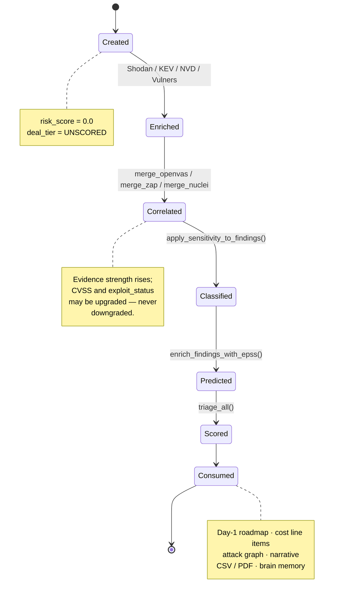

# Data Model

The definitive reference for RedFlag's core data structures, verified field by field against
`analysis/schema.py` and `cost/schema.py`.

_Last updated: 2026-07-27 · Owner: Adi · Status: Handover_

---

## 1. The `Finding` model

Defined in [`analysis/schema.py`](../../analysis/schema.py). A Pydantic v2 `BaseModel` with
`model_config = ConfigDict(use_enum_values=True)`.

> **Consequence of `use_enum_values=True`:** enum-typed fields on a `Finding` instance hold the
> **string value** (`"internet_facing"`), not the enum member. But `analysis/triage.py` assigns
> enum *objects* to `deal_tier`. Always normalise with
> `str(getattr(x, "value", x))` — the `_v()` helper used throughout the codebase — and never with
> `str(x)`, which yields `"DealTier.CRITICAL"` on an enum member and silently breaks comparisons.

### Identity

| Field | Type | Default | Meaning |
|---|---|---|---|
| `id` | `str` | `uuid4()` hex string | Stable identifier; referenced by `CostLineItem.finding_ids` |
| `cve_id` | `str \| None` | `None` | CVE identifier when the finding maps to one |
| `title` | `str` | **required** | Human-readable headline, e.g. `"RDP service exposed on port 3389"` |

### Location

| Field | Type | Default | Meaning |
|---|---|---|---|
| `host` | `str \| None` | `None` | IP address or hostname |
| `port` | `int \| None` | `None` | TCP/UDP port. `None` for host-level findings (Shodan CVE intelligence, DNS records) |
| `service` | `str \| None` | `None` | Service name as reported by the scanner (`"ssh"`, `"http"`, `"dns"`, `"breach"`) |

### Severity and likelihood

| Field | Type | Default | Meaning |
|---|---|---|---|
| `cvss_score` | `float` | `0.0` | CVSS base score. **Constrained `0.0 ≤ x ≤ 10.0`** by Pydantic |
| `epss_score` | `float \| None` | `None` | EPSS probability of exploitation within 30 days, `0.0`–`1.0` |
| `epss_percentile` | `float \| None` | `None` | EPSS rank against all CVEs, `0.0`–`1.0` |

### Narrative

| Field | Type | Default | Meaning |
|---|---|---|---|
| `description` | `str` | `""` | What the issue is and why it matters commercially |
| `remediation` | `str` | `""` | Concrete fix guidance; also feeds the Day-1 roadmap items |

### Risk dimensions — the four scoring inputs

| Field | Type | Default | Meaning |
|---|---|---|---|
| `exposure` | `ExposureLevel` | `UNKNOWN` | Where the asset sits relative to the internet |
| `data_sensitivity` | `DataSensitivity` | `UNKNOWN` | Business/regulatory value of the data at risk |
| `exploit_status` | `ExploitStatus` | `UNKNOWN` | Whether a working exploit exists |
| *(plus `cvss_score` above)* | | | The fourth input |

### Provenance

| Field | Type | Default | Meaning |
|---|---|---|---|
| `scanner_source` | `ScannerSource` | `MANUAL` | Which tool produced the finding |
| `evidence_strength` | `EvidenceStrength` | `UNKNOWN` | How well corroborated it is; multiplies the score |
| `raw_data` | `dict \| None` | `None` | Untyped scanner payload. Also carries pipeline markers such as `epss_promoted`, `shodan_port_match`, `kev_hit` |

### Triage output — written by `analysis/triage.py`

| Field | Type | Default | Meaning |
|---|---|---|---|
| `risk_score` | `float` | `0.0` | Final 0–100 score. Forced to exactly `100.0` by a deal-killer override |
| `deal_tier` | `DealTier` | `UNSCORED` | Classification derived from `risk_score`, or forced by an override |
| `override_reason` | `str \| None` | `None` | **Dual-purpose.** Written by triage to explain a forced deal-killer verdict; *also read as an input* — if it contains the phrase `"active compromise"`, it triggers a deal-killer override |

### Timestamp

| Field | Type | Default | Meaning |
|---|---|---|---|
| `discovered_at` | `datetime` | `datetime.now(timezone.utc)` | UTC creation time; exported in the CSV |

---

## 2. Enums

All six live in `analysis/schema.py` and inherit from `str, Enum`, so they compare equal to their
string values.

### `ExposureLevel` — where the asset sits

| Member | Value | Meaning | Score |
|---|---|---|---|
| `INTERNET_FACING` | `internet_facing` | Reachable from the public internet | 100 |
| `PARTNER` | `partner` | Reachable from a partner or extranet network | 60 |
| `INTERNAL` | `internal` | Reachable only from inside the corporate network | 30 |
| `UNKNOWN` | `unknown` | Not established | 50 |

Set by `analysis/parser.py` (`PARTNER` for commonly exposed services, else `INTERNAL`), upgraded
to `INTERNET_FACING` by `enrich_findings_with_shodan()` when Shodan confirms the port, and set
directly to `INTERNET_FACING` by the DNS, TLS, breach and Shodan-standalone paths.

### `DataSensitivity` — what is at risk

| Member | Value | Meaning | Score |
|---|---|---|---|
| `CROWN_JEWEL` | `crown_jewel` | The organisation's most valuable data or systems | 100 |
| `REGULATED` | `regulated` | Subject to GDPR, HIPAA, PCI-DSS or equivalent | 85 |
| `SENSITIVE` | `sensitive` | Confidential but not regulated | 55 |
| `LOW` | `low` | Public or low-value | 20 |
| `UNKNOWN` | `unknown` | Not classified | 50 |

Only ever set from the **asset-inventory Excel upload**
(`apply_sensitivity_to_findings()`), which upgrades a finding **only if it is currently
`UNKNOWN`** — it never downgrades. Without that upload, every finding stays `UNKNOWN` and scores
the neutral 50.

### `ExploitStatus` — can it actually be exploited

| Member | Value | Meaning | Score |
|---|---|---|---|
| `ACTIVE_EXPLOITATION` | `active_exploitation` | Confirmed exploited in the wild (CISA KEV) | 100 |
| `PUBLIC_EXPLOIT` | `public_exploit` | A public proof of concept exists | 65 |
| `NO_EXPLOIT` | `no_exploit` | No known exploit | 10 |
| `UNKNOWN` | `unknown` | Not established | 30 |

Note that `UNKNOWN` (30) scores **higher** than `NO_EXPLOIT` (10) — absence of evidence is
treated as more dangerous than evidence of absence.

Sources, in order of authority: CISA KEV → `ACTIVE_EXPLOITATION`; LeakIX credential/database
exposure → `ACTIVE_EXPLOITATION`; Vulners API confirmation → `PUBLIC_EXPLOIT`; EPSS ≥ 0.50
promotion → `PUBLIC_EXPLOIT`. Upgrades only — `_higher_exploit()` helpers and
`get_exploit_status_from_vulners()` never downgrade.

### `EvidenceStrength` — how well corroborated

| Member | Value | Meaning | Multiplier |
|---|---|---|---|
| `CONFIRMED` | `confirmed` | Directly verified by a scanner that tested it | **1.00** |
| `CORRELATED` | `correlated` | Two independent sources agree | **0.95** |
| `UNKNOWN` | `unknown` | Not established | **0.90** |
| `INFERRED` | `inferred` | Deduced, e.g. a missing DKIM selector across common names | **0.85** |
| `EXTERNAL` | `external` | Third-party intelligence not independently verified | **0.80** |

The multiplier is applied to the weighted base score. Rationale:
[ADR-0006](../process/adr/0006-evidence-strength-multiplier.md).

### `DealTier` — the commercial verdict

| Member | Value | Meaning | Recommended action |
|---|---|---|---|
| `DEAL_KILLER` | `deal_killer` | Blocks the close | Escalate before signing |
| `CRITICAL` | `critical` | Score ≥ 75 | Remediate within 30 days of close |
| `MODERATE` | `moderate` | Score ≥ 50 | 90-day post-close roadmap |
| `MANAGEABLE` | `manageable` | Score < 50 | Standard hygiene backlog |
| `UNSCORED` | `unscored` | Triage has not run | Skipped by the cost estimator |

### `ScannerSource` — provenance

| Member | Value | Produced by |
|---|---|---|
| `NMAP` | `nmap` | `analysis/parser.py` |
| `SHODAN` | `shodan` | `scanners/shodan_scan.py` |
| `OPENVAS` | `openvas` | `scanners/openvas_parse.py` |
| `ZAP` | `zap` | `scanners/zap_scan.py` |
| `NUCLEI` | `nuclei` | `scanners/nuclei_scan.py` |
| `VULNERS` | `vulners` | `scanners/vulners_parse.py` |
| `DNS` | `dns` | `scanners/dns_scan.py` |
| `TLS` | `tls` | `scanners/tls_scan.py` |
| `BREACH` | `breach` | `scanners/breach_scan.py` |
| `PDF` | `pdf_upload` | *Reserved — no producer today* |
| `EXCEL` | `excel_upload` | *Reserved — the Excel parser modifies findings rather than creating them* |
| `EMAIL` | `email_attachment` | *Reserved — no producer today* |
| `MANUAL` | `manual` | Default when nothing sets it |

---

## 3. Derived and scoring fields

`risk_score` and `deal_tier` are written onto the `Finding` in place by
`analysis/triage.py:triage()`.

```python
# analysis/triage.py — the exact computation
cvss_normalized  = (finding.cvss_score / 10.0) * 100

base = (cvss_normalized   * WEIGHT_CVSS         # 0.25
      + exposure_score    * WEIGHT_EXPOSURE     # 0.25
      + sensitivity_score * WEIGHT_SENSITIVITY  # 0.20
      + exploit_score     * WEIGHT_EXPLOIT)     # 0.30

risk_score = round(base * EVIDENCE_MULTIPLIERS[evidence_strength], 2)
```

**Override rules run first.** `check_override_rules()` is evaluated *before* any scoring, and a
match short-circuits: `risk_score = 100.0`, `deal_tier = DEAL_KILLER`, and `override_reason` is
overwritten with the explanation. The four conditions are documented in
[RESULTS_INTERPRETATION.md](../user/RESULTS_INTERPRETATION.md).

`triage_all()` maps `triage()` over the list and returns it **sorted by `risk_score`
descending** — the order the UI and every export rely on.

---

## 4. Lifecycle of a `Finding`



1. **Created** — a scanner instantiates it. `risk_score` is `0.0`, `deal_tier` is `UNSCORED`.
2. **Enriched** — Shodan may upgrade `exposure` to `INTERNET_FACING` and `evidence_strength` to
   `CORRELATED`; KEV may set `ACTIVE_EXPLOITATION`; NVD may raise `cvss_score`.
3. **Correlated** — an OpenVAS, ZAP or Nuclei result matching the same `host:port` upgrades the
   existing finding in place rather than adding a duplicate.
   ([ADR-0008](../process/adr/0008-uploads-correlate-not-replace.md))
4. **Classified** — the asset-inventory Excel stamps `data_sensitivity`, but only over `UNKNOWN`.
5. **Predicted** — EPSS attaches `epss_score`/`epss_percentile` and, at ≥ 0.50, promotes an
   `UNKNOWN` or `NO_EXPLOIT` status to `PUBLIC_EXPLOIT`, marking `raw_data["epss_promoted"]`.
   ([ADR-0007](../process/adr/0007-epss-exploit-promotion.md))
6. **Scored** — `triage_all()` writes `risk_score` and `deal_tier`.
7. **Consumed** — by the Day-1 roadmap, cost estimator, attack brain and graph, narrative engine,
   CSV/PDF exporters, and the brain's `learn_from_scan()`.

---

## 5. Secondary models

### Cost — `cost/schema.py`

| Model | Purpose |
|---|---|
| `CostTriple` | Frozen `low` / `base` / `high` USD triple. Supports `+`, `.total(scenario)`, `.spread_ratio()`. A cost is **never** a single number |
| `CostLineItem` | One remediation or integration line. Carries `bucket` (`"remediation"` or `"integration"`), `category`, `capex_opex`, `confidence`, `review_flags`, `finding_ids`, and dedup metadata |
| `CostScenario` | Totals for one of low/base/high, split CapEx/OpEx |
| `CostRollup` | The aggregate: totals, bucket split, per-category breakdown, three scenarios, `accuracy_pct`, the P10/P50/P90 interval, and the review gate |

Enums: `RemediationCategory` (11 members), `CapexOpex` (3), `CostConfidence` (3), `ScenarioType`
(3), `ReviewFlag` (5).

### Maturity — `analysis/maturity.py` and `analysis/standards_compare.py`

| Model | Purpose |
|---|---|
| `DomainScore` | Frozen. One domain's weighted 0–5 score plus its thresholds and `gap_severity` |
| `MaturityAssessment` | All seven domain scores, overall score, deal-blocker flags, completion percentage |
| `MaturityGapSeverity` | `DEAL_BLOCKER` / `BELOW_MIN` / `ACCEPTABLE` / `AT_TARGET` |
| `GapItem` | One gap with its catalogue key for cost lookup |
| `GapReport` | Gaps split into deal-blocker, below-minimum and improvement buckets |

### Day-1 — `analysis/day1.py`

| Model | Purpose |
|---|---|
| `Day1Phase` | `P0_PRE_CONNECT` / `P1_CONTAIN` / `P2_STABILISE` / `P3_INTEGRATE_READY` |
| `ConnectivityModel` | `ISOLATE` / `BROKER` / `FEDERATE` / `INTEGRATE` |
| `PillarStatus` | `GREEN` / `AMBER` / `RED` / `UNKNOWN` |
| `Pillar` | One review pillar with RAG status, evidence and a status-keyed recommendation |
| `CriterionResult` / `IntegrationGate` | A single gate criterion and the gate that aggregates them |
| `Day1ActionItem` | One roadmap item — a finding or a maturity gap — assigned to a phase |
| `Day1Blueprint` | The full result: recommended model, catalogue, pillars, gates, roadmap |

### Attack analysis — `analysis/attack_brain.py` and `analysis/attack_graph.py`

| Model | Purpose |
|---|---|
| `Technique` | A MITRE ATT&CK technique with tactic, ID, name and a `.ref` URL |
| `AttackStep` / `AttackPlan` | The narrated kill-chain and its mind-map stages |
| `MindStage` / `MindChild` | Mind-map branch structure |
| `Chokepoint` / `CrownPath` / `GraphReport` | Quantitative graph output |
| `BrainStats` / `BrainInsight` | Knowledge-base read models |

---

## Related documents

- [RESULTS_INTERPRETATION.md](../user/RESULTS_INTERPRETATION.md) — what the numbers mean to a reader
- [ARCHITECTURE.md](ARCHITECTURE.md) — where these objects flow
- [MODULE_REFERENCE.md](MODULE_REFERENCE.md) — the functions that create and mutate them
- [CONFIGURATION.md](CONFIGURATION.md) — the weights and thresholds referenced here
- [ADR-0006](../process/adr/0006-evidence-strength-multiplier.md), [ADR-0007](../process/adr/0007-epss-exploit-promotion.md), [ADR-0008](../process/adr/0008-uploads-correlate-not-replace.md)
